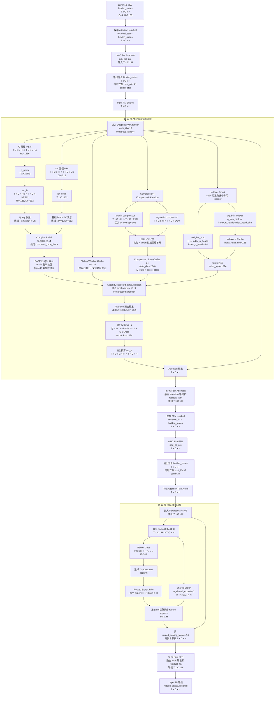

# DeepSeek-V4 第 10 层详细流程图

> 第 10 层按 0 起始编号，即 `layer_idx = 10`。根据 DeepSeek-V4-Pro 的 `compress_ratios` 配置，第 10 层的 `compress_ratio = 4`，所以它是一个 **c4 / Compress-4-Attention 层**，会创建 `Compressor 4` 和 `Indexer`。

## 第 10 层配置

```text
layer_idx: 10
compress_ratio: 4
cache family: c4
hidden_size H: 7168
hc_mult C: 4
num_attention_heads Nh: 128
num_key_value_heads Nkv: 1
head_dim Dh: 512
q_lora_rank Rq: 1536
o_lora_rank Ro: 1024
qk_rope_head_dim Dr: 64
qk_nope_head_dim Dn: 448
o_groups G: 16
sliding_window W: 128
index_n_heads: 64
index_head_dim: 128
index_topk: 1024
MoE routed experts E: 384
num_experts_per_tok TopK: 6
n_shared_experts: 1
moe_intermediate_size: 3072
```

维度记号：

```text
T: 当前 forward 中的 token 数
C: hc_mult = 4
H: hidden_size = 7168
Rq: q_lora_rank = 1536
Ro: o_lora_rank = 1024
Nh: attention heads = 128
Dh: head_dim = 512
Dr: RoPE dim = 64
Dn: no-RoPE dim = 448
G: output groups = 16
E: routed experts = 384
TopK: 每 token 选择 6 个 expert
```

## Mermaid 流程图



## 第 10 层的关键点

1. 第 10 层是 `c4` 层，不是 `c128` 层。
2. 因为 `compress_ratio = 4`，所以这一层会创建：
   - `Compressor 4`
   - `Indexer`
   - `Compressor State Cache c4`
3. c4 层的 Indexer 用于辅助稀疏选择远端压缩块；c128 层没有这个 c4 专用 Indexer。
4. 近期上下文仍有 `sliding_window = 128` 的局部窗口路径。
5. 第 10 层整体仍然是 decoder layer 结构：

```text
mHC Pre Attention
-> RMSNorm
-> c4 Hybrid Attention
-> mHC Post Attention
-> mHC Pre FFN
-> RMSNorm
-> MoE
-> mHC Post FFN
```

## 本地源码依据

- `D:/lzy/project/kv_pool/code/vllm-ascend/vllm_ascend/models/deepseek_v4.py:701`：`DeepseekV4Attention` 定义。
- `D:/lzy/project/kv_pool/code/vllm-ascend/vllm_ascend/models/deepseek_v4.py:780`：每层读取 `compress_ratio`。
- `D:/lzy/project/kv_pool/code/vllm-ascend/vllm_ascend/models/deepseek_v4.py:805`：`compress_ratio > 1` 时创建 `Compressor`。
- `D:/lzy/project/kv_pool/code/vllm-ascend/vllm_ascend/models/deepseek_v4.py:816`：`compress_ratio == 4` 时创建 `Indexer`。
- `D:/lzy/project/kv_pool/code/vllm-ascend/vllm_ascend/models/deepseek_v4.py:847`：创建 `AscendDeepseekV4SWACache`。
- `D:/lzy/project/kv_pool/code/vllm-ascend/vllm_ascend/models/deepseek_v4.py:903`：单个 decoder layer 定义。
- `D:/lzy/project/kv_pool/code/vllm-ascend/vllm_ascend/models/deepseek_v4.py:974`：单层 forward 流程。
