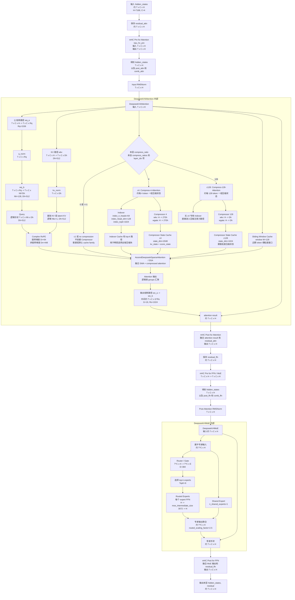
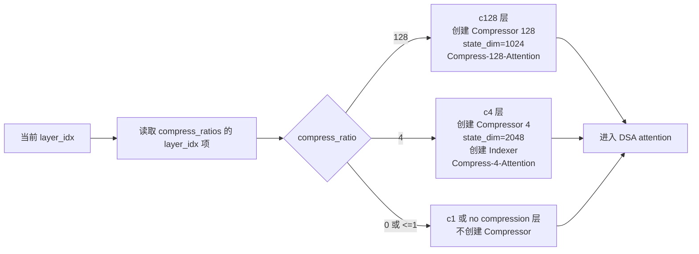
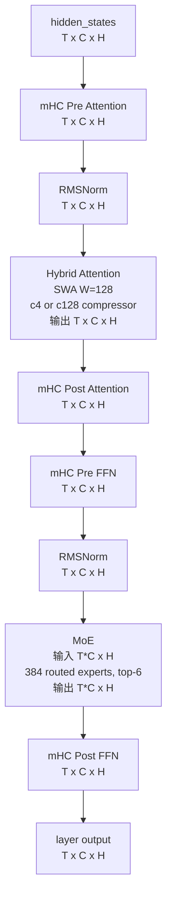

# DeepSeek-V4 单层流程图

> 说明：本图基于 `vllm-ascend` 中 `DeepseekV4Attention` / `DeepseekV2DecoderLayer` 的实现，以及 DeepSeek-V4-Pro `config.json` 中的关键配置整理。由于 Hugging Face 页面在线抓取受限，配置字段来自用户贴出的 `deepseek-ai/DeepSeek-V4-Pro/config.json` 内容，并结合本地源码分析。

## 配置要点

```text
model_type: deepseek_v4
num_hidden_layers: 61
num_nextn_predict_layers: 1
hidden_size H: 7168
hc_mult C: 4
num_attention_heads Nh: 128
num_key_value_heads Nkv: 1
head_dim Dh: 512
q_lora_rank Rq: 1536
o_lora_rank Ro: 1024
qk_rope_head_dim Dr: 64
qk_nope_head_dim Dn: 448
o_groups G: 16
sliding_window W: 128
compress_ratios: 62 项 = 31 个 c128 + 30 个 c4 + 1 个 0
MoE: 384 routed experts, 每 token 选 6 个 expert, 1 个 shared expert
mHC: hc_mult=4, hc_sinkhorn_iters=20, hc_eps=1e-6
```

维度记号：

```text
T: 当前 forward 中展平后的 token 数，约等于 batch 内所有 scheduled tokens 总数
H: hidden_size = 7168
C: hc_mult = 4
Rq: q_lora_rank = 1536
Ro: o_lora_rank = 1024
Nh: num_attention_heads = 128
Dh: head_dim = 512
Dr: qk_rope_head_dim = 64
Dn: head_dim - qk_rope_head_dim = 448
G: o_groups = 16
E: n_routed_experts = 384
TopK: num_experts_per_tok = 6
```

主模型 61 层压缩配置：

```text
layer 0  -> c128
layer 1  -> c128
layer 2  -> c4
layer 3  -> c128
layer 4  -> c4
...
layer 59 -> c128
layer 60 -> c4
MTP layer -> 0 / no compression
```

## Mermaid 流程图



## 压缩层选择图



## 单层结构简化版



## 关键理解

1. DeepSeek-V4 的每一层不是同时拥有 c1/c4/c128 三套完整 attention，而是通过 `compress_ratios[layer_idx]` 决定这一层的压缩类型。
2. DeepSeek-V4-Pro 主模型 61 层里，c128 和 c4 基本交替：31 个 c128 层，30 个 c4 层。
3. c4 层会创建 `Compressor 4` 和 `Indexer`，c128 层会创建 `Compressor 128`，但没有 c4 那种专用 Indexer。
4. `sliding_window=128` 表示近期上下文还有局部窗口机制；压缩 attention 主要服务于长上下文效率。
5. `mHC` 包在 attention 和 MoE 前后，替代普通残差连接的简单加法，形成更复杂的 residual/hyper-connection 混合。
6. 图中的维度是根据配置和源码整理的逻辑维度，底层 Ascend kernel 可能会为了并行、量化、图编译和内存布局做进一步重排。

## 本地源码依据

- `D:/lzy/project/kv_pool/code/vllm-ascend/vllm_ascend/models/deepseek_v4.py:701`：`DeepseekV4Attention` 定义。
- `D:/lzy/project/kv_pool/code/vllm-ascend/vllm_ascend/models/deepseek_v4.py:780`：每层读取 `compress_ratio`。
- `D:/lzy/project/kv_pool/code/vllm-ascend/vllm_ascend/models/deepseek_v4.py:805`：`compress_ratio > 1` 时创建 `Compressor`。
- `D:/lzy/project/kv_pool/code/vllm-ascend/vllm_ascend/models/deepseek_v4.py:816`：`compress_ratio == 4` 时创建 `Indexer`。
- `D:/lzy/project/kv_pool/code/vllm-ascend/vllm_ascend/models/deepseek_v4.py:847`：创建 `AscendDeepseekV4SWACache`。
- `D:/lzy/project/kv_pool/code/vllm-ascend/vllm_ascend/models/deepseek_v4.py:903`：单个 decoder layer 定义。
- `D:/lzy/project/kv_pool/code/vllm-ascend/vllm_ascend/models/deepseek_v4.py:974`：单层 forward 流程。
